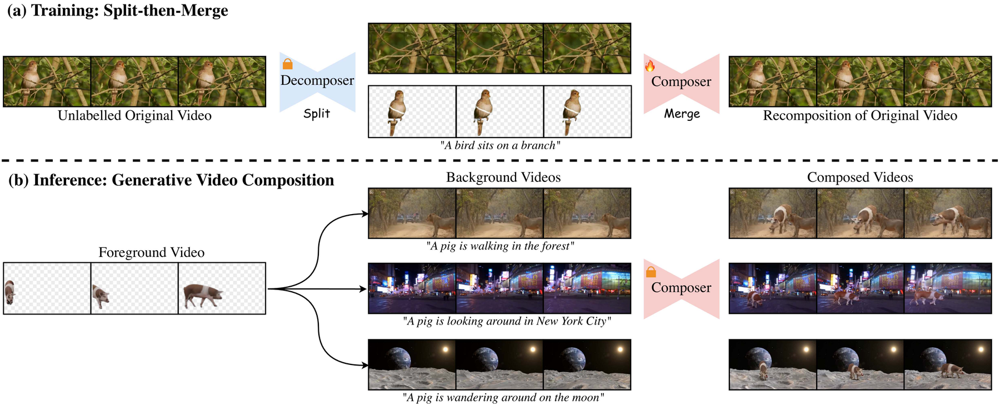
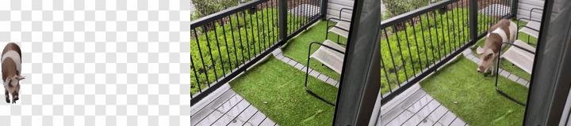
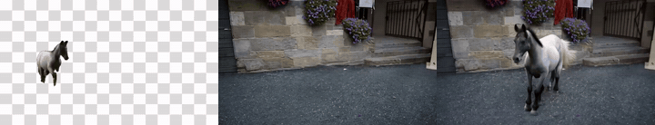
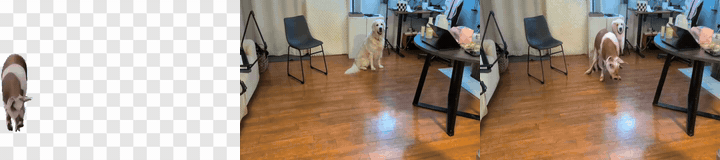
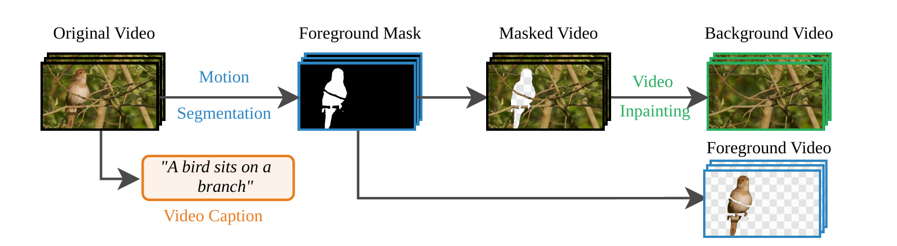
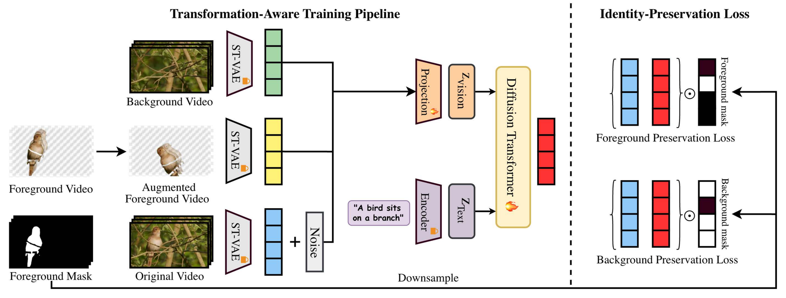

<div align="center">

# Layer-Aware Video Composition via Split-then-Merge

[**Ozgur Kara**](https://karaozgur.com/)<sup>1†</sup> · [**Yujia Chen**](https://issaccyj.github.io/)<sup>2</sup> · [**Ming-Hsuan Yang**](https://scholar.google.com/citations?user=p9-ohHsAAAAJ&hl=en)<sup>2</sup> · [**James M. Rehg**](https://rehg.org/)<sup>1</sup> · [**Wen-Sheng Chu**](https://l2ior.github.io/)<sup>2‡</sup> · [**Du Tran**](https://dutran.github.io/)<sup>2‡</sup>

<sup>1</sup> University of Illinois Urbana-Champaign &nbsp;&nbsp; <sup>2</sup> Google

<sup>†</sup> Work done during an internship at Google &nbsp;&nbsp; <sup>‡</sup> Joint last authors

### ECCV 2026

[](https://arxiv.org/abs/2511.20809)
[](https://split-then-merge.github.io/)
[](https://arxiv.org/abs/2511.20809)
[](https://arxiv.org/pdf/2511.20809)
[](https://split-then-merge.github.io/supplementary.html)



</div>

Model and StM-50K dataset coming soon.

**TL;DR** — **Split-then-Merge (StM)** is a video composition framework that *splits* unlabeled videos into dynamic
foreground and background layers with off-the-shelf models and trains a generative **Composer** to *merge* them
back. It learns affordance (where and how a subject can exist in a scene), preserves the subject's identity and
motion, and harmonizes lighting, shadows and camera motion — without annotated composition data.

## Abstract

We present Split-then-Merge (StM), a controllable generative video composition framework that minimizes reliance on
annotated datasets and handcrafted rules. Instead of requiring manual supervision, StM decomposes unlabeled videos
into dynamic foreground and background layers. By self-composing these elements, the model learns to synthesize
complex interactions between moving subjects and diverse scenes, capturing the intricate dynamics necessary for
high-fidelity video generation. Specifically, StM introduces a transformation-aware training pipeline utilizing
multi-layer fusion and augmentation to address affordance challenges in video composition. An identity-preservation
loss further maintains foreground fidelity during blending. Extensive experiments show that StM outperforms
state-of-the-art methods on both quantitative benchmarks and qualitative evaluations, including human studies and
Vision-Language Model assessments. Finally, we release StM-50K, the first multi-layer video dataset, to facilitate
future research in generative video composition.

## Results

Each clip shows **input foreground · input background · StM result** (more on the [project page](https://split-then-merge.github.io/)).

<table>
<tr>
<td align="center"><br><em>"A pig is walking in the forest"</em></td>
<td align="center"><br><em>"A pig is wandering around in the balcony"</em></td>
</tr>
<tr>
<td align="center"><br><em>StM-50K test example</em></td>
<td align="center"><br><em>StM-50K test example</em></td>
</tr>
<tr>
<td align="center"><br><em>Logically impossible composition — "A boat is floating on a road"</em></td>
<td align="center"><br><em>Multi-object composition — "A pig is walking indoors"</em></td>
</tr>
</table>

**Comparison with prior work** — input foreground · input background · Copy-Paste (CogVideoX-I2V) · SkyReels-A2 · AnyV2V · **StM (ours)**:


## Method

<p align="center"></p>

**Decomposer.** Off-the-shelf models split an unlabeled video: motion segmentation
([Segment Any Motion](https://motion-seg.github.io/)) produces the foreground mask and layer, a video inpainter
([MiniMax-Remover](https://github.com/zibojia/MiniMax-Remover)) fills the holes of the background layer, and a
VLM ([InternVL2.5](https://huggingface.co/OpenGVLab/InternVL2_5-1B)) captions the original video.

<p align="center"></p>

**Composer.** A [CogVideoX-5b-I2V](https://huggingface.co/THUDM/CogVideoX-5b-I2V) fine-tune reconstructs the
original video latent from the foreground, background and caption. Multi-layer fusion concatenates the noisy
latent with the (augmented) foreground and background latents; transformation-aware augmentation prevents the
copy-paste shortcut; an identity-preservation loss keeps foreground fidelity.

## Repository

```
data_processing/   generate_data.py (sources → clips → caption/mask/layers/inpaint → manifest), run_openvid_pipeline.sh, make_preview.py
training/          train.py, train.sh, configs/{recipes,accelerate,augmentation}
inference/         compose.py — sample compositions from a checkpoint on any (prompt, fg, bg) manifest
evaluation/        run_eval.py (M1–M5), run_vlm_judge.py, metrics/            (evaluation/README.md)
tests/             CPU checks (pytest)
stm/               the library: data_generation/, data/ (datasets + augmentations), models/ (CogVideoX-I2V + StM Composer), trainer.py
setup/             setup_env.sh, download_checkpoints.sh
third_party/       Segment-Any-Motion (+SAM2, TAPNet, DINOv2), MiniMax-Remover        (THIRD_PARTY_NOTICES.md)
assets/            figures and GIFs used in this README
```

### Setup

```bash
git clone <repository-url> stm && cd stm
ln -s /path/to/bulk/storage data           # raw videos, clips, datasets, checkpoints, HF cache live here
bash setup/setup_env.sh                    # ~/venvs/stm: torch 2.8/cu128, deps, SAM2, `pip install -e .`
source ~/venvs/stm/bin/activate && export HF_HOME=$PWD/data/hf_cache
bash setup/download_checkpoints.sh         # InternVL2.5-1B, Depth-Anything-V2, BootsTAPIR, DINOv2, moseg, SAM2, MiniMax-Remover, CogVideoX-5b-I2V
sudo apt-get install ffmpeg
```

`make` wraps the common commands: `make setup ckpts davis test-set index data status manifest verify stats preview eval-segmenter train train-smoke validate eval test lint`.

### Data processing (Decomposer)

```bash
# sources → 49×480×720 clips in data/clips/<source>/
python data_processing/generate_data.py import-davis                         # DAVIS-2017 with GT masks (validation only, as in the paper)
python data_processing/generate_data.py import-test-set                      # the paper's 93 test triplets from the released results → data/datasets/stm_test
curl -L -o data/raw/openvid/OpenVid-1M.csv https://huggingface.co/datasets/nkp37/OpenVid-1M/resolve/main/data/train/OpenVid-1M.csv
make index                                                                   # rank OpenVid-1M zip parts by usable (Panda-70M-derived, moving-subject) videos
python data_processing/generate_data.py import-openvid-remote --parts 112 77 # stream only those videos via HTTP ranges (no 40 GB zips), then chunk
python data_processing/generate_data.py chunk --source my_videos --raw-dir /videos   # any folder (put mask videos in clips/<src>/masks/ to bypass the segmenter)

# Decomposer: mask → fg-ratio gate → caption → layers → inpaint (one resident worker per listed GPU id; repeat an id for several workers)
python data_processing/generate_data.py process --sources openvid davis --gpus 0 0 0 0
python data_processing/generate_data.py status | manifest | verify | stats  # counts · txt lists + metadata.csv · 49×480×720@16fps check · README with statistics
python data_processing/make_preview.py                                        # self-contained results page (looping input / mask / fg / bg clips)

# unattended production run (ranked parts → import → decompose → manifest → verify) until TARGET_DONE accepted clips
PYTHON=~/venvs/stm/bin/python GPUS="0 0 0 0" TARGET_DONE=100000 nohup bash data_processing/run_openvid_pipeline.sh > data/openvid_driver.log 2>&1 &
```

Per clip: InternVL2.5-1B caption (12 frames, *"Describe the video in detail"*); Segment-Any-Motion mask
(Depth-Anything-V2 → DINOv2 → BootsTAPIR → moseg → SAM2, default settings, models kept resident); `fg` = video ⊙ mask on
black, `bg` = hole, `bg-inpainted` = MiniMax-Remover (12 steps).  Clips with no moving object or a
foreground ratio outside [0.01, 0.45] are recorded as `skipped` (the paper's `main_train_foreground_volume`
filter).  Output (`data/datasets/stm_gen/`):

```
prompts.txt videos.txt fg.txt fg-black.txt bg.txt masks.txt images.txt   aligned lists   ·   metadata.csv
records/<id>.json  provenance + timings + status (resumable)             ·   README.md (statistics)  ·  preview/
<source>/{videos,masks,fg,bg,bg-inpainted,first_frames}/
```

Each worker needs ~15 GB of GPU memory (4 fit on an 80 GB GPU); runs are resumable and can be stopped/restarted at
any time.  Faster, approximately equivalent settings (`--tracks-per-query-frame 1100`, `--depth-model …-Small-hf`) are opt-in.

### Training (Composer)

```bash
bash training/train.sh training/configs/recipes/stm_main.conf     # paper recipe: FSDP2, bf16, 20K iters, batch 64, lr 5e-6 cosine, α 0.5, paper augmentation
bash training/train.sh training/configs/recipes/smoke_lora.conf   # single-GPU LoRA smoke test (dataset → loss → checkpoint → resume → validation)
DRY_RUN=1 bash training/train.sh <conf>                            # print the launch command only
# multi-node: NUM_NODES=4 NODE_RANK=$RANK MASTER_ADDR=… bash training/train.sh training/configs/recipes/stm_main.conf
```

Runs go to `outputs/<recipe>/<run_id>/checkpoint-<step>` (accelerate state) with `args.json`;
`RESUME=true` resumes the latest run.  Variables: `training/train.sh`; ablations: `training/configs/recipes/ablations.md`.

### Inference

```bash
python -m accelerate.commands.launch --config_file training/configs/accelerate/single_gpu.yaml \
  inference/compose.py --checkpoint_path outputs/stm_main/0001/checkpoint-20000 \
  --validation_dir data/datasets/stm_test --output_dir outputs/validation --guidance_scales 2 4 6 8
```

(use the FSDP accelerate config of the training run when loading a full fine-tuning checkpoint.)
A checkpoint is a trainer-saved `checkpoint-<step>/` directory (FSDP shards, or
`pytorch_lora_weights.safetensors` for LoRA runs) next to the run's `args.json`; `--validation_dir` is any
manifest folder (`prompts.txt`, `fg-black.txt`/`fg.txt`, `bg.txt`, optional `masks.txt`).  Outputs mirror the
released result folders: `sample-<i>_gs-<gs>_<prompt>-<hash>/{video_generated,video_fg_gt,video_bg_gt}.mp4`.

### Evaluation

```bash
python evaluation/run_eval.py --results outputs/validation/validation_checkpoint-20000 --out outputs/eval/ckpt20000   # M1–M5
GEMINI_API_KEY=… python evaluation/run_vlm_judge.py --ours <results A> --baseline <results B> --out outputs/judge/B  # pairwise VLM judge
pytest tests -q                                                                                                        # CPU checks of the pipeline
```

`evaluation/metrics/` implements M1/M2/M5 (ViCLIP), M3 (VideoSwin action KL) and M4 (optical-flow MSE)
on layers re-decomposed with Segment-Any-Motion, and the judge prompts of Appendix A2.3/A2.4 — see
`evaluation/README.md`.

## Citation

```bibtex
@inproceedings{kara2026stm,
  title     = {Layer-Aware Video Composition via Split-then-Merge},
  author    = {Kara, Ozgur and Chen, Yujia and Yang, Ming-Hsuan and Rehg, James M. and Chu, Wen-Sheng and Tran, Du},
  booktitle = {European Conference on Computer Vision (ECCV)},
  year      = {2026}
}
```

## Acknowledgements

The Composer builds on [CogVideoX](https://github.com/THUDM/CogVideo) and its fine-tuning code; the Decomposer
uses [Segment Any Motion in Videos](https://motion-seg.github.io/) (with [SAM 2](https://github.com/facebookresearch/sam2),
[TAPNet](https://github.com/google-deepmind/tapnet), [DINOv2](https://github.com/facebookresearch/dinov2) and
[Depth Anything V2](https://github.com/DepthAnything/Depth-Anything-V2)), [MiniMax-Remover](https://github.com/zibojia/MiniMax-Remover)
and [InternVL](https://github.com/OpenGVLab/InternVL); evaluation uses [ViCLIP](https://github.com/OpenGVLab/InternVideo)
and torchvision's Video Swin / RAFT. Licenses of the bundled components and model weights are listed in
[THIRD_PARTY_NOTICES.md](THIRD_PARTY_NOTICES.md).
